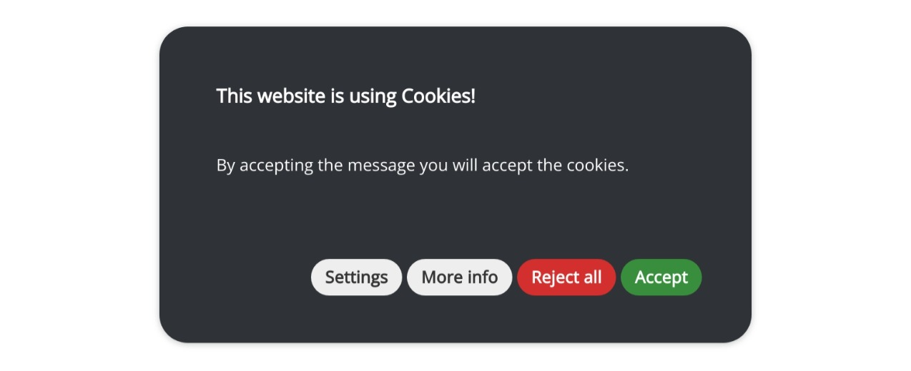
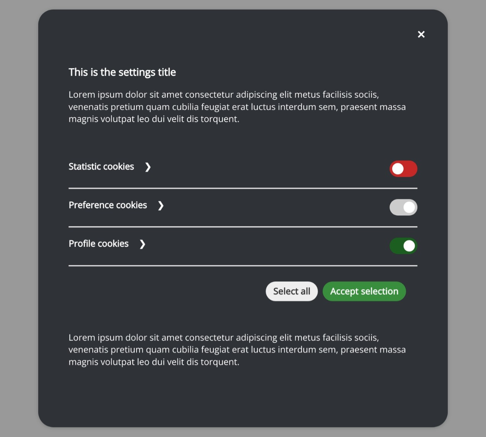

# Dark Theme

Dark theme is a simple theme that is designed to be a starting point for your own customizations.

## Installation

You need to import this css files `before` the main CSS file.

::: code-group

```postcss [postcss]
@import '@metamorfosilab/cookies-consent/dist/themes/dark.css';
```

```scss [scss]
@import '~@metamorfosilab/cookies-consent/dist/themes/dark.css';
```

```css [css]
@import '@metamorfosilab/cookies-consent/dist/themes/dark.css';
```
:::

## Preview



## Settings Preview


