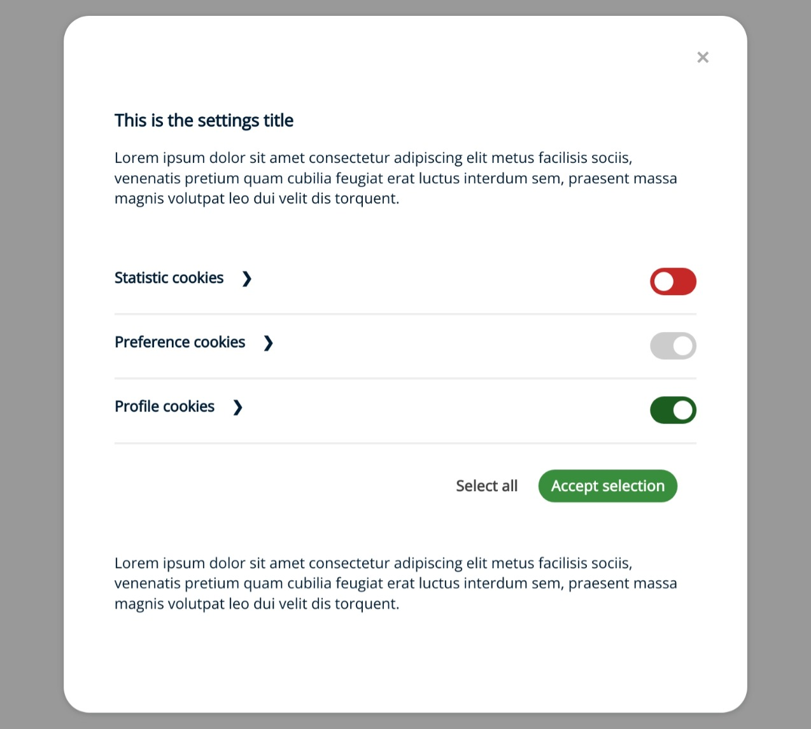

# Default Theme

The default theme is a simple theme that is designed to be a starting point for your own customizations.

## Installation

For this theme, you don't need to specify `theme` property in the configuration object.

## Preview

## Settings Preview

